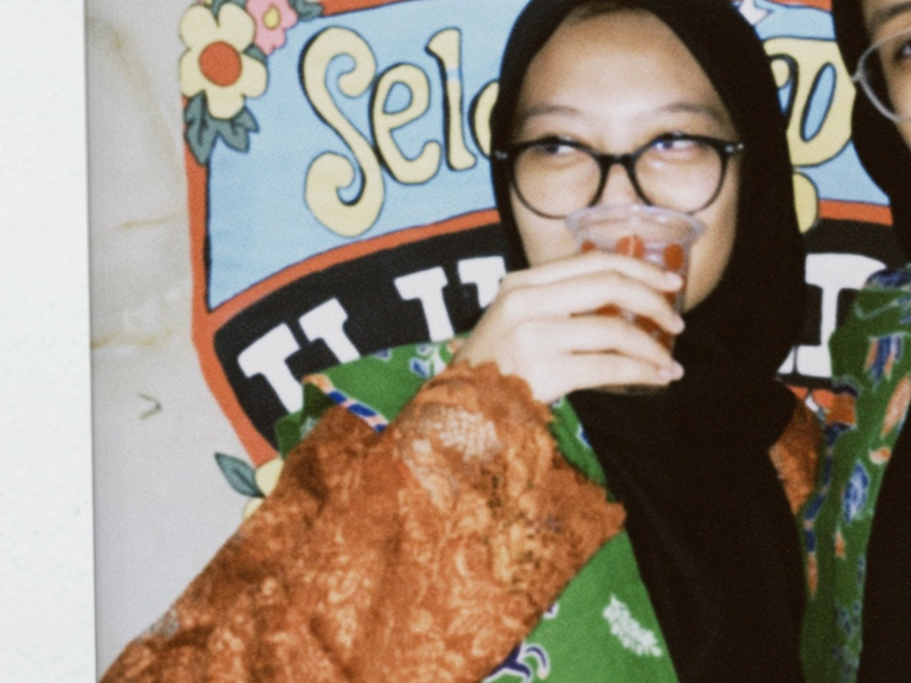

<!-- Profile README for GitHub: saaqr -->

 
  
  # 👋 Yo, I'm **Soonya** 🦊

---

### 🦊 About Me
* 🛠️ Lagi belajar ngoding step by step (Python, web, etc.)  
* 🔍 Suka nyari cara gampang buat bikin ide jadi nyata  
* 🌱 Masih newbie, tapi semangat terus upgrade skill  
* 🎯 Next goal: bikin project keren & bermanfaat  

---

## 🌐 Connect With Me

  
  

---

## 📊 GitHub Stats

  
  

  

---

## 👀 Profile Visitors

  

---

## 🎉 Fun Animation

  

